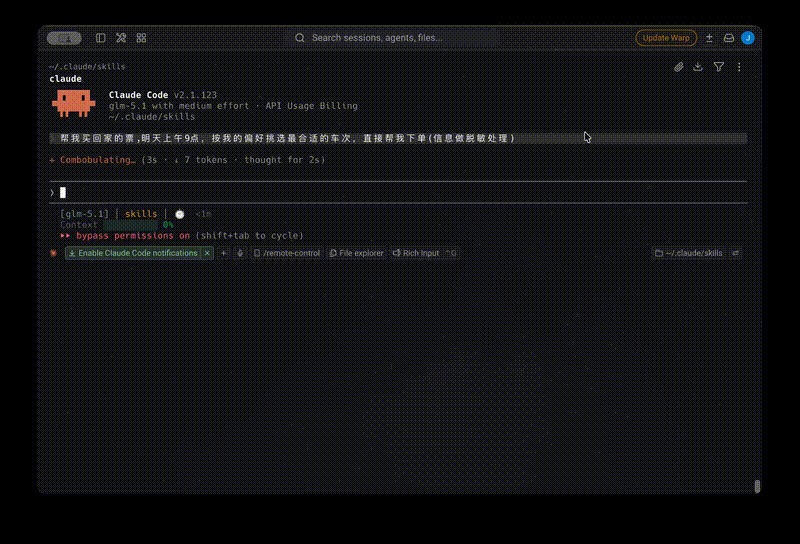

# 🚄 12306-skill

<!-- TODO: 替换为实际 banner 图片路径 -->
<!--  -->

**用自然语言买火车票。查余票、选座、下单，一句话搞定。** 🎫

---

## ✨ 效果示例



### 🔍 日常查询

```
用户：帮我查明天杭州东到宁波的高铁

AI：找到以下车次（2025-05-08，杭州东→宁波）：

| 车次   | 出发  | 到达  | 历时  | 二等座 | 一等座 |
|--------|-------|-------|-------|--------|--------|
| G7521  | 08:12 | 09:02 | 50分  | 有     | 有     |
| G7523  | 09:30 | 10:20 | 50分  | 有     | 无     |
| G7525  | 10:45 | 11:40 | 55分  | 无     | 无     |

推荐 G7521，最早出发，历时最短。请问购买哪趟？
```

### 🏠 场景匹配，一句话购票

```
用户：帮我买回家的票

AI：匹配到「回家」场景：
- 杭州东 → 宁波 · 08:00-12:00 · 乘客：张三

正在查询 2025-05-08 的车次...

| 车次   | 出发  | 到达  | 历时  | 二等座 |
|--------|-------|-------|-------|--------|
| G7521  | 08:12 | 09:02 | 50分  | 有     |

用户：G7521 二等座靠窗

AI：确认订单：G7521 · 2025-05-08 · 杭州东→宁波 · 二等座靠窗 · 张三
确认下单？

用户：确认

AI：下单成功！订单号：E123456789
请在 20 分钟内完成支付。
```

### 💰 智能排序，多人购票

```
用户：后天北京南到上海虹桥，下午的动车，最便宜的

AI：按价格排序（2025-05-10，北京南→上海虹桥，下午时段）：

| 车次  | 出发  | 到达  | 历时  | 二等座 | 一等座 |
|-------|-------|-------|-------|--------|--------|
| D717  | 14:20 | 20:05 | 5h45m | ¥263   | -      |
| D719  | 15:00 | 20:50 | 5h50m | ¥263   | -      |

推荐 D717，价格最低，出发最早。

用户：D717，二等座过道，李四和王五

AI：确认订单：D717 · 2025-05-10 · 北京南→上海虹桥
- 李四 · 二等座过道
- 王五 · 二等座过道
确认下单？

用户：确认

AI：下单成功！订单号：E987654321
```

---

## 📦 安装

需要 [Node.js](https://nodejs.org/) 和 [Bun](https://bun.sh/)。

```bash
npx add-skill cuddle-ai/12306-skill
```

安装后，在 Claude Code 中说「帮我查票」或「买票」即可。

---

## 🎯 核心功能

| 功能 | 说明 |
|------|------|
| 🔎 余票查询 | 自然语言输入出发站、到达站、日期，返回实时余票 |
| 📊 智能排序 | 按历时、价格或出发时间排序，推荐最优车次 |
| 💺 精准选座 | 支持靠窗、过道等选座偏好 |
| 👥 多人购票 | 一单多位乘客，自动匹配账号联系人 |
| ⭐ 场景保存 | 保存常用路线（如「回家」「出差」），下次一句话触发 |
| 📱 扫码登录 | 首次使用终端显示二维码，扫码后自动保持登录 |

---

## 🚀 首次使用

首次触发时会自动引导完成：

1. 📥 **安装依赖** — `bun install`
2. ⚙️ **偏好设置** — 座位类型、选座偏好、车次类型、排序方式
3. 📌 **创建场景**（可选） — 如「回家」「出差上海」

首次查询后会自动触发扫码登录，终端显示二维码，用 12306 APP 扫描即可。后续无需重复登录。

> 配置保存在 `~/.12306/EXTEND.md`，详细 schema 见 [preferences-schema.md](references/config/preferences-schema.md)。

---

## ⚙️ 工作原理

```
检查登录 → 场景匹配 → 查询余票 → 展示推荐 → 确认下单
```

所有脚本独立运行，输出标准 JSON，AI 负责解析结果并与用户交互。

详细工作流定义见 [SKILL.md](SKILL.md)。

---

## 📁 仓库结构

```
12306-skill/
├── SKILL.md              # 工作流定义（权威参考）
├── scripts/              # TypeScript 脚本
│   ├── check.ts          # 检查登录状态
│   ├── login.ts          # 扫码登录
│   ├── query.ts          # 查询余票
│   ├── passengers.ts     # 获取乘客列表
│   ├── order.ts          # 提交订单
│   └── common.ts         # 公共工具
├── references/           # 参考文档
│   ├── seat-codes.md     # 座位编码说明
│   └── config/           # 配置 schema & 首次设置
└── assets/
    └── stations.txt      # 全国站名编码表
```

## 📄 License

MIT
